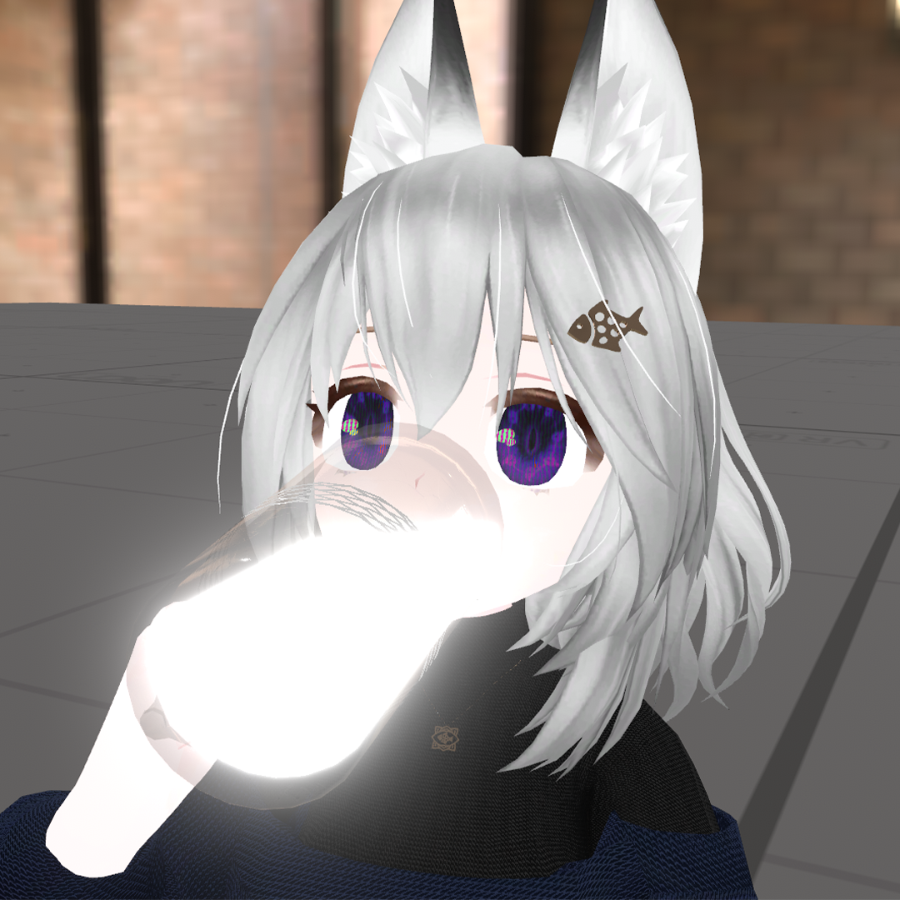

## 1. PROJECT METADATA ##
Generation date: 05/30/2026 00:46:53
Project directory: G:\WEBSITE
Current commit: 4714e30

## 2. FULL FILE STRUCTURE ##
(Displaying the full directory tree, as Windows 'tree' lacks --fromfile)
Folder PATH listing for volume Randum 
Volume serial number is 000000A8 02C4:3060
G:.
|   .gitattributes
|   .gitignore
|   C418 - Minecraft - Minecraft Volume Alpha.m4a
|   clickcounter.css
|   compress-images.js
|   full_project_context.md
|   gallery.css
|   gallery.html
|   galleryscript.js
|   generate-gallery.js
|   images.json
|   index.html
|   info.css
|   Luigi Boccherini Minuetto (classical).m4a
|   mainpage.css
|   mainscript.js
|   minecraft_click.mp3
|   package-lock.json
|   package.json
|   RandumJumpscare.png
|   socials.css
|   textaboveimage.css
|   trajava.ps1
|   
+---.vscode
|       launch.json
|       
+---favicon
|       favicon.png
|       
+---fonts
|       Minecraftia-Regular.ttf
|       
+---images
|       2381014283-510634784-dfa24a76-9ee6-488e-9dcf-9a608d8a7710.00_02_54_23.Still001.jpg
|       DrunkRandum.jpg
|       Monke.jpg
|       VRChat_2024-07-19_02-38-04.177_1920x1080.jpg
|       VRChat_2024-07-21_02-35-03.187_1920x1080.jpg
|       VRChat_2024-08-18_05-42-54.345_720x1280.jpg
|       VRChat_2024-08-27_03-47-39.023_1280x720.jpg
|       VRChat_2024-08-28_06-00-33.477_720x1280.jpg
|       VRChat_2025-01-21_20-03-35.207_1920x1080.jpg
|       VRChat_2025-03-05_05-59-31.615_1920x1080.jpg
|       VRChat_2025-04-01_05-20-36.157_1920x1080.jpg
|       VRChat_2025-04-03_03-02-01.245_1920x1080.jpg
|       VRChat_2025-04-03_03-05-27.421_1920x1080.jpg
|       VRChat_2025-04-03_23-13-23.033_1920x1080.jpg
|       VRChat_2025-04-18_05-06-11.115_1920x1080.jpg
|       VRChat_2025-04-18_05-11-14.937_1920x1080.jpg
|       VRChat_2025-04-18_05-16-16.018_1920x1080.jpg
|       VRChat_2025-04-22_02-54-27.081_1080x1920.jpg
|       VRChat_2025-04-24_03-49-15.388_1920x1080.jpg
|       VRChat_2025-05-05_04-19-09.411_1080x1920.jpg
|       VRChat_2025-05-14_04-36-14.502_1920x1080.jpg
|       VRChat_2025-05-14_04-54-30.045_1920x1080.jpg
|       VRChat_2025-05-16_04-57-57.474_1920x1080.jpg
|       VRChat_2025-05-16_05-59-10.900_1080x1920.jpg
|       VRChat_2025-05-18_04-36-58.717_1920x1080.jpg
|       VRChat_2025-05-18_05-52-59.802_1920x1080.jpg
|       VRChat_2025-05-19_04-59-08.601_1920x1080.jpg
|       VRChat_2025-05-21_05-56-59.jpg
|       VRChat_2025-06-05_01-29-10.567_1920x1080.jpg
|       VRChat_2025-06-08_00-49-27.862_1920x1080.jpg
|       VRChat_2025-06-08_01-05-13.669_1920x1080.jpg
|       VRChat_2025-06-13_02-37-12.613_1920x1080.jpg
|       VRChat_2025-06-15_03-58-55.jpg
|       VRChat_2025-06-16_04-28-29.037_1920x1080.jpg
|       VRChat_2025-06-24_04-32-19.260_1920x1080.jpg
|       VRChat_2025-06-26_04-42-46.jpg
|       VRChat_2025-06-26_04-50-22.835_1920x1080.jpg
|       VRChat_2025-07-04_03-25-36.jpg
|       VRChat_2025-07-08_06-55-51.165_1920x1080.jpg
|       VRChat_2025-07-12_02-03-46.jpg
|       VRChat_2025-07-13_05-46-58.jpg
|       VRChat_2025-07-14_05-34-42.jpg
|       VRChat_2025-07-19_04-01-37.jpg
|       VRChat_2025-07-19_05-15-49.jpg
|       VRChat_2025-07-19_05-21-05.jpg
|       VRChat_2025-07-21_03-56-10.jpg
|       VRChat_2025-07-31_19-34-48.653_1920x1080.jpg
|       VRChat_2025-08-01_04-33-59.jpg
|       VRChat_2025-08-01_04-39-53.jpg
|       VRChat_2025-08-03_05-37-42.477_1920x1080.jpg
|       VRChat_2025-08-03_06-29-00.jpg
|       VRChat_2025-08-04_02-39-28.503_1920x1080.jpg
|       VRChat_2025-08-16_04-06-16.jpg
|       VRChat_2025-08-16_04-48-38.jpg
|       VRChat_2025-09-13_03-52-17.jpg
|       VRChat_2025-09-28_04-36-21.jpg
|       VRChat_2025-09-28_05-00-08.jpg
|       VRChat_2025-09-28_05-02-07.jpg
|       VRChat_2025-10-01_04-25-30.jpg
|       VRChat_2025-10-02_05-36-23.jpg
|       VRChat_2025-10-03_05-47-05.jpg
|       VRChat_2025-10-07_21-28-15.009_1920x1080.jpg
|       VRChat_2025-10-26_06-48-06.614_1920x1080.jpg
|       VRChat_2025-11-01_07-43-15.jpg
|       VRChat_2025-11-02_05-17-35.319_1920x1080.jpg
|       VRChat_2025-11-02_05-24-00.gif
|       VRChat_2025-11-02_05-24-22.gif
|       VRChat_2025-11-03_08-32-14.gif
|       VRChat_2025-11-05_04-28-22.gif
|       VRChat_2025-11-05_05-33-05.jpg
|       VRChat_2025-11-05_05-38-05.gif
|       VRChat_2025-11-05_05-42-24.gif
|       VRChat_2025-11-05_12-25-10.gif
|       VRChat_2025-11-09_22-06-03.809_7680x4320.png
|       VRChat_2025-11-16_04-21-21.gif
|       VRChat_2025-11-17_00-16-05.gif
|       VRChat_2025-11-21_22-20-53.584_1920x1080.png
|       VRChat_2025-11-23_00-49-17.gif
|       VRChat_2025-11-24_04-01-48.jpg
|       VRChat_2025-11-24_05-28-47.jpg
|       VRChat_2025-11-24_05-35-42.jpg
|       VRChat_2025-11-24_17-30-43.gif
|       VRChat_2025-11-24_17-38-52.gif
|       VRChat_2025-11-24_17-59-08.gif
|       VRChat_2025-11-25_06-29-38.gif
|       VRChat_2025-11-25_06-34-02.gif
|       VRChat_2025-11-26_04-09-46.jpg
|       VRChat_2025-11-28_04-17-48.gif
|       VRChat_2025-11-28_04-37-54.gif
|       VRChat_2025-11-28_05-03-24.gif
|       VRChat_2025-11-29_21-06-46.338_1920x1080.jpg
|       VRChat_2025-11-29_22-03-14.512_1920x1080.jpg
|       VRChat_2025-11-30_05-46-41.319_1920x1080.jpg
|       VRChat_2025-12-03_05-08-07.gif
|       VRChat_2025-12-03_07-00-01.jpg
|       VRChat_2025-12-03_07-00-45.gif
|       VRChat_2025-12-03_07-07-16.gif
|       VRChat_2025-12-03_07-25-27.gif
|       VRChat_2025-12-03_07-37-08.gif
|       VRChat_2025-12-12_04-54-03.gif
|       VRChat_2025-12-12_06-11-27.gif
|       VRChat_2025-12-12_06-33-39.504_2048x1440.jpg
|       VRChat_2025-12-13_05-17-36.009_2048x1440.jpg
|       VRChat_2025-12-15_04-12-52.624_2048x1440.jpg
|       VRChat_2025-12-15_05-10-16.493_1920x1080.jpg
|       VRChat_2025-12-15_05-12-29.gif
|       VRChat_2025-12-15_05-36-24.038_2048x1440.jpg
|       VRChat_2025-12-17_05-42-00.075_1920x1080.jpg
|       VRChat_2025-12-17_05-54-13.346_1920x1080.jpg
|       VRChat_2025-12-20_04-33-30.129_1920x1080.jpg
|       VRChat_2025-12-20_04-42-34.gif
|       VRChat_2025-12-21_04-13-24.jpg
|       VRChat_2025-12-21_05-32-31.jpg
|       VRChat_2025-12-24_04-49-16.jpg
|       VRChat_2025-12-24_06-46-57.gif
|       VRChat_2025-12-24_07-07-46.jpg
|       VRChat_2025-12-24_07-13-50.jpg
|       VRChat_2025-12-24_07-19-21.jpg
|       VRChat_2025-12-27_05-28-08.726_1920x1080.jpg
|       VRChat_2025-12-28_04-22-10.958_1920x1080.jpg
|       VRChat_2025-12-30_04-45-25.774_1920x1080.jpg
|       VRChat_2025-12-30_04-45-48.350_1920x1080.jpg
|       VRChat_2026-01-01_00-26-27.jpg
|       VRChat_2026-01-01_01-55-07.040_1920x1080.jpg
|       VRChat_2026-01-05_04-57-11.gif
|       VRChat_2026-01-06_03-51-36.432_1920x1080.jpg
|       VRChat_2026-01-06_03-56-49.503_1920x1080.jpg
|       VRChat_2026-01-06_04-21-43.153_1920x1080.jpg
|       VRChat_2026-01-09_04-51-51.gif
|       VRChat_2026-01-09_05-12-07.gif
|       VRChat_2026-01-09_05-21-13.jpg
|       VRChat_2026-01-09_05-32-27.jpg
|       VRChat_2026-01-10_06-58-35.320_2048x1440.jpg
|       VRChat_2026-01-12_00-53-37.414_1920x1080.jpg
|       VRChat_2026-01-12_00-54-36.307_1920x1080.jpg
|       VRChat_2026-01-14_05-32-24.gif
|       VRChat_2026-01-14_05-42-14.735_1920x1080.jpg
|       VRChat_2026-01-14_05-42-39.307_1920x1080.jpg
|       VRChat_2026-01-14_05-43-12.755_1920x1080.jpg
|       VRChat_2026-01-14_05-46-44.548_1920x1080.jpg
|       VRChat_2026-01-14_05-46-55.460_1920x1080.png
|       VRChat_2026-01-15_06-51-21.gif
|       VRChat_2026-01-15_06-55-16.gif
|       VRChat_2026-01-16_06-09-43.jpg
|       VRChat_2026-01-16_20-30-51.jpg
|       VRChat_2026-01-17_04-27-03.gif
|       VRChat_2026-01-17_20-17-04.jpg
|       VRChat_2026-01-17_20-59-45.250_1920x1080.jpg
|       VRChat_2026-01-18_01-36-18.529_1920x1080.jpg
|       VRChat_2026-01-18_05-14-31.gif
|       VRChat_2026-01-18_05-17-24.gif
|       VRChat_2026-01-18_06-24-55.jpg
|       VRChat_2026-01-20_06-04-08.285_1920x1080.jpg
|       VRChat_2026-01-20_06-21-08.jpg
|       VRChat_2026-01-26_04-42-49.gif
|       VRChat_2026-01-29_06-20-42.gif
|       VRChat_2026-02-01_05-06-40.jpg
|       VRChat_2026-02-04_04-16-31.jpg
|       VRChat_2026-02-04_04-39-12.gif
|       VRChat_2026-02-04_05-52-46.jpg
|       VRChat_2026-02-07_04-54-43.gif
|       VRChat_2026-02-07_04-54-49.jpg
|       VRChat_2026-02-07_05-19-54.jpg
|       VRChat_2026-02-07_05-21-07.jpg
|       VRChat_2026-02-07_05-23-36.gif
|       VRChat_2026-02-07_06-40-13.jpg
|       VRChat_2026-02-07_06-43-34.jpg
|       VRChat_2026-02-07_06-47-41.gif
|       VRChat_2026-02-07_07-36-27.gif
|       VRChat_2026-02-07_07-45-40.gif
|       VRChat_2026-02-07_08-06-54.gif
|       VRChat_2026-02-07_08-26-24.gif
|       VRChat_2026-02-14_01-32-00.jpg
|       VRChat_2026-02-14_09-23-59.793_1080x1920.jpg
|       VRChat_2026-02-15_04-28-22.gif
|       VRChat_2026-02-17_04-10-48.979_1920x1080.jpg
|       VRChat_2026-02-20_05-01-05.gif
|       VRChat_2026-02-21_03-17-03.gif
|       VRChat_2026-02-27_08-49-14.690_1920x1080.jpg
|       VRChat_2026-02-28_03-41-31.119_1080x1920.jpg
|       VRChat_2026-03-02_08-51-51.gif
|       VRChat_2026-03-02_08-52-22.gif
|       VRChat_2026-03-03_08-18-52.gif
|       VRChat_2026-03-04_00-19-05.gif
|       VRChat_2026-03-06_07-29-35.jpg
|       VRChat_2026-03-06_07-47-37.gif
|       VRChat_2026-03-08_05-32-29.gif
|       VRChat_2026-03-08_08-21-26.gif
|       VRChat_2026-03-08_08-33-31.gif
|       VRChat_2026-03-08_08-35-40.jpg
|       VRChat_2026-03-08_08-38-51.gif
|       VRChat_2026-03-08_08-47-36.gif
|       VRChat_2026-03-08_09-25-27.gif
|       VRChat_2026-03-08_09-33-58.261_1080x1920.jpg
|       
\---images-optimized
        2381014283-510634784-dfa24a76-9ee6-488e-9dcf-9a608d8a7710.00_02_54_23.Still001.webp
        DrunkRandum.webp
        Monke.webp
        VRChat_2024-07-19_02-38-04.177_1920x1080.webp
        VRChat_2024-07-21_02-35-03.187_1920x1080.webp
        VRChat_2024-08-18_05-42-54.345_720x1280.webp
        VRChat_2024-08-27_03-47-39.023_1280x720.webp
        VRChat_2024-08-28_06-00-33.477_720x1280.webp
        VRChat_2025-01-21_20-03-35.207_1920x1080.webp
        VRChat_2025-03-05_05-59-31.615_1920x1080.webp
        VRChat_2025-04-01_05-20-36.157_1920x1080.webp
        VRChat_2025-04-03_03-02-01.245_1920x1080.webp
        VRChat_2025-04-03_03-05-27.421_1920x1080.webp
        VRChat_2025-04-03_23-13-23.033_1920x1080.webp
        VRChat_2025-04-18_05-06-11.115_1920x1080.webp
        VRChat_2025-04-18_05-11-14.937_1920x1080.webp
        VRChat_2025-04-18_05-16-16.018_1920x1080.webp
        VRChat_2025-04-22_02-54-27.081_1080x1920.webp
        VRChat_2025-04-24_03-49-15.388_1920x1080.webp
        VRChat_2025-05-05_04-19-09.411_1080x1920.webp
        VRChat_2025-05-14_04-36-14.502_1920x1080.webp
        VRChat_2025-05-14_04-54-30.045_1920x1080.webp
        VRChat_2025-05-16_04-57-57.474_1920x1080.webp
        VRChat_2025-05-16_05-59-10.900_1080x1920.webp
        VRChat_2025-05-18_04-36-58.717_1920x1080.webp
        VRChat_2025-05-18_05-52-59.802_1920x1080.webp
        VRChat_2025-05-19_04-59-08.601_1920x1080.webp
        VRChat_2025-05-21_05-56-59.webp
        VRChat_2025-06-05_01-29-10.567_1920x1080.webp
        VRChat_2025-06-08_00-49-27.862_1920x1080.webp
        VRChat_2025-06-08_01-05-13.669_1920x1080.webp
        VRChat_2025-06-13_02-37-12.613_1920x1080.webp
        VRChat_2025-06-15_03-58-55.webp
        VRChat_2025-06-16_04-28-29.037_1920x1080.webp
        VRChat_2025-06-24_04-32-19.260_1920x1080.webp
        VRChat_2025-06-26_04-42-46.webp
        VRChat_2025-06-26_04-50-22.835_1920x1080.webp
        VRChat_2025-07-04_03-25-36.webp
        VRChat_2025-07-08_06-55-51.165_1920x1080.webp
        VRChat_2025-07-12_02-03-46.webp
        VRChat_2025-07-13_05-46-58.webp
        VRChat_2025-07-14_05-34-42.webp
        VRChat_2025-07-19_04-01-37.webp
        VRChat_2025-07-19_05-15-49.webp
        VRChat_2025-07-19_05-21-05.webp
        VRChat_2025-07-21_03-56-10.webp
        VRChat_2025-07-31_19-34-48.653_1920x1080.webp
        VRChat_2025-08-01_04-33-59.webp
        VRChat_2025-08-01_04-39-53.webp
        VRChat_2025-08-03_05-37-42.477_1920x1080.webp
        VRChat_2025-08-03_06-29-00.webp
        VRChat_2025-08-04_02-39-28.503_1920x1080.webp
        VRChat_2025-08-16_04-06-16.webp
        VRChat_2025-08-16_04-48-38.webp
        VRChat_2025-09-13_03-52-17.webp
        VRChat_2025-09-28_04-36-21.webp
        VRChat_2025-09-28_05-00-08.webp
        VRChat_2025-09-28_05-02-07.webp
        VRChat_2025-10-01_04-25-30.webp
        VRChat_2025-10-02_05-36-23.webp
        VRChat_2025-10-03_05-47-05.webp
        VRChat_2025-10-07_21-28-15.009_1920x1080.webp
        VRChat_2025-10-26_06-48-06.614_1920x1080.webp
        VRChat_2025-11-01_07-43-15.webp
        VRChat_2025-11-02_05-17-35.319_1920x1080.webp
        VRChat_2025-11-02_05-24-00.webp
        VRChat_2025-11-02_05-24-22.webp
        VRChat_2025-11-03_08-32-14.webp
        VRChat_2025-11-05_04-28-22.webp
        VRChat_2025-11-05_05-33-05.webp
        VRChat_2025-11-05_05-38-05.webp
        VRChat_2025-11-05_05-42-24.webp
        VRChat_2025-11-05_12-25-10.webp
        VRChat_2025-11-09_22-06-03.809_7680x4320.webp
        VRChat_2025-11-16_04-21-21.webp
        VRChat_2025-11-17_00-16-05.webp
        VRChat_2025-11-21_22-20-53.584_1920x1080.webp
        VRChat_2025-11-23_00-49-17.webp
        VRChat_2025-11-24_04-01-48.webp
        VRChat_2025-11-24_05-28-47.webp
        VRChat_2025-11-24_05-35-42.webp
        VRChat_2025-11-24_17-30-43.webp
        VRChat_2025-11-24_17-38-52.webp
        VRChat_2025-11-24_17-59-08.webp
        VRChat_2025-11-25_06-29-38.webp
        VRChat_2025-11-25_06-34-02.webp
        VRChat_2025-11-26_04-09-46.webp
        VRChat_2025-11-28_04-17-48.webp
        VRChat_2025-11-28_04-37-54.webp
        VRChat_2025-11-28_05-03-24.webp
        VRChat_2025-11-29_21-06-46.338_1920x1080.webp
        VRChat_2025-11-29_22-03-14.512_1920x1080.webp
        VRChat_2025-11-30_05-46-41.319_1920x1080.webp
        VRChat_2025-12-03_05-08-07.webp
        VRChat_2025-12-03_07-00-01.webp
        VRChat_2025-12-03_07-00-45.webp
        VRChat_2025-12-03_07-07-16.webp
        VRChat_2025-12-03_07-25-27.webp
        VRChat_2025-12-03_07-37-08.webp
        VRChat_2025-12-12_04-54-03.webp
        VRChat_2025-12-12_06-11-27.webp
        VRChat_2025-12-12_06-33-39.504_2048x1440.webp
        VRChat_2025-12-13_05-17-36.009_2048x1440.webp
        VRChat_2025-12-15_04-12-52.624_2048x1440.webp
        VRChat_2025-12-15_05-10-16.493_1920x1080.webp
        VRChat_2025-12-15_05-12-29.webp
        VRChat_2025-12-15_05-36-24.038_2048x1440.webp
        VRChat_2025-12-17_05-42-00.075_1920x1080.webp
        VRChat_2025-12-17_05-54-13.346_1920x1080.webp
        VRChat_2025-12-20_04-33-30.129_1920x1080.webp
        VRChat_2025-12-20_04-42-34.webp
        VRChat_2025-12-21_04-13-24.webp
        VRChat_2025-12-21_05-32-31.webp
        VRChat_2025-12-24_04-49-16.webp
        VRChat_2025-12-24_06-46-57.webp
        VRChat_2025-12-24_07-07-46.webp
        VRChat_2025-12-24_07-13-50.webp
        VRChat_2025-12-24_07-19-21.webp
        VRChat_2025-12-27_05-28-08.726_1920x1080.webp
        VRChat_2025-12-28_04-22-10.958_1920x1080.webp
        VRChat_2025-12-30_04-45-25.774_1920x1080.webp
        VRChat_2025-12-30_04-45-48.350_1920x1080.webp
        VRChat_2026-01-01_00-26-27.webp
        VRChat_2026-01-01_01-55-07.040_1920x1080.webp
        VRChat_2026-01-05_04-57-11.webp
        VRChat_2026-01-06_03-51-36.432_1920x1080.webp
        VRChat_2026-01-06_03-56-49.503_1920x1080.webp
        VRChat_2026-01-06_04-21-43.153_1920x1080.webp
        VRChat_2026-01-09_04-51-51.webp
        VRChat_2026-01-09_05-12-07.webp
        VRChat_2026-01-09_05-21-13.webp
        VRChat_2026-01-09_05-32-27.webp
        VRChat_2026-01-10_06-58-35.320_2048x1440.webp
        VRChat_2026-01-12_00-53-37.414_1920x1080.webp
        VRChat_2026-01-12_00-54-36.307_1920x1080.webp
        VRChat_2026-01-14_05-32-24.webp
        VRChat_2026-01-14_05-42-14.735_1920x1080.webp
        VRChat_2026-01-14_05-42-39.307_1920x1080.webp
        VRChat_2026-01-14_05-43-12.755_1920x1080.webp
        VRChat_2026-01-14_05-46-44.548_1920x1080.webp
        VRChat_2026-01-14_05-46-55.460_1920x1080.webp
        VRChat_2026-01-15_06-51-21.webp
        VRChat_2026-01-15_06-55-16.webp
        VRChat_2026-01-16_06-09-43.webp
        VRChat_2026-01-16_20-30-51.webp
        VRChat_2026-01-17_04-27-03.webp
        VRChat_2026-01-17_20-17-04.webp
        VRChat_2026-01-17_20-59-45.250_1920x1080.webp
        VRChat_2026-01-18_01-36-18.529_1920x1080.webp
        VRChat_2026-01-18_05-14-31.webp
        VRChat_2026-01-18_05-17-24.webp
        VRChat_2026-01-18_06-24-55.webp
        VRChat_2026-01-20_06-04-08.285_1920x1080.webp
        VRChat_2026-01-20_06-21-08.webp
        VRChat_2026-01-26_04-42-49.webp
        VRChat_2026-01-29_06-20-42.webp
        VRChat_2026-02-01_05-06-40.webp
        VRChat_2026-02-04_04-16-31.webp
        VRChat_2026-02-04_04-39-12.webp
        VRChat_2026-02-04_05-52-46.webp
        VRChat_2026-02-07_04-54-43.webp
        VRChat_2026-02-07_04-54-49.webp
        VRChat_2026-02-07_05-19-54.webp
        VRChat_2026-02-07_05-21-07.webp
        VRChat_2026-02-07_05-23-36.webp
        VRChat_2026-02-07_06-40-13.webp
        VRChat_2026-02-07_06-43-34.webp
        VRChat_2026-02-07_06-47-41.webp
        VRChat_2026-02-07_07-36-27.webp
        VRChat_2026-02-07_07-45-40.webp
        VRChat_2026-02-07_08-06-54.webp
        VRChat_2026-02-07_08-26-24.webp
        VRChat_2026-02-14_01-32-00.webp
        VRChat_2026-02-14_09-23-59.793_1080x1920.webp
        VRChat_2026-02-15_04-28-22.webp
        VRChat_2026-02-17_04-10-48.979_1920x1080.webp
        VRChat_2026-02-20_05-01-05.webp
        VRChat_2026-02-21_03-17-03.webp
        VRChat_2026-02-27_08-49-14.690_1920x1080.webp
        VRChat_2026-02-28_03-41-31.119_1080x1920.webp
        VRChat_2026-03-02_08-51-51.webp
        VRChat_2026-03-02_08-52-22.webp
        VRChat_2026-03-03_08-18-52.webp
        VRChat_2026-03-04_00-19-05.webp
        VRChat_2026-03-06_07-29-35.webp
        VRChat_2026-03-06_07-47-37.webp
        VRChat_2026-03-08_05-32-29.webp
        VRChat_2026-03-08_08-21-26.webp
        VRChat_2026-03-08_08-33-31.webp
        VRChat_2026-03-08_08-35-40.webp
        VRChat_2026-03-08_08-38-51.webp
        VRChat_2026-03-08_08-47-36.webp
        VRChat_2026-03-08_09-25-27.webp
        VRChat_2026-03-08_09-33-58.261_1080x1920.webp
        

## 3. CONTENT OF ALL FILES ##
--- START OF FILE: .gitattributes ---
# Auto detect text files and perform LF normalization
* text=auto

--- END OF FILE: .gitattributes ---

--- START OF FILE: .gitignore ---
.vscode
node_modules
--- END OF FILE: .gitignore ---

--- START OF FILE: .vscode/launch.json ---
{
    // Use IntelliSense to learn about possible attributes.
    // Hover to view descriptions of existing attributes.
    // For more information, visit: https://go.microsoft.com/fwlink/?linkid=830387
    "version": "0.2.0",
    "configurations": [
        {
            "type": "chrome",
            "request": "launch",
            "name": "Launch Chrome against localhost",
            "url": "http://localhost:8080",
            "webRoot": "${workspaceFolder}"
        }
    ]
}
--- END OF FILE: .vscode/launch.json ---

--- START OF FILE: clickcounter.css ---
@font-face {
  font-family: "Minecraft";
  src: url("fonts/Minecraftia-Regular.ttf") format("truetype");
}

.counter {
  margin-top: 12px;
  font-family: "Minecraft", monospace;
  font-size: 36px;
  color: white;
  letter-spacing: px;
  text-shadow: 
    1px 1px 0 #000,
    2px 2px 0 #000;
  opacity: 0.85;
  user-select: none;
  transform: translateY(-120px);
}
--- END OF FILE: clickcounter.css ---

--- START OF FILE: compress-images.js ---
const fs = require('fs');
const path = require('path');
const sharp = require('sharp');

const inputDir = path.join(__dirname, 'images');
const outputDir = path.join(__dirname, 'images-optimized');

// Create output directory if it doesn't exist
if (!fs.existsSync(outputDir)) {
    fs.mkdirSync(outputDir, { recursive: true });
}

// Allowed extensions
const validExtensions = ['.jpg', '.jpeg', '.png', '.gif'];

async function processImages() {
    try {
        const files = fs.readdirSync(inputDir);
        const images = files.filter(file => {
            const ext = path.extname(file).toLowerCase();
            return validExtensions.includes(ext);
        });

        console.log(`Found ${images.length} images to compress. Starting...`);

        let processedCount = 0;
        let totalOriginalSize = 0;
        let totalOptimizedSize = 0;

        for (const file of images) {
            const ext = path.extname(file).toLowerCase();
            const basename = path.basename(file, ext);
            // Output file will always be .webp
            const outputFile = `${basename}.webp`;
            
            const inputPath = path.join(inputDir, file);
            const outputPath = path.join(outputDir, outputFile);
            
            const isAnimated = ext === '.gif';

            try {
                const stats = fs.statSync(inputPath);
                totalOriginalSize += stats.size;

                await sharp(inputPath, { animated: isAnimated })
                    .webp({
                        quality: 85,
                        effort: 4,
                    })
                    .toFile(outputPath);

                // Get new size
                const newStats = fs.statSync(outputPath);
                totalOptimizedSize += newStats.size;

                processedCount++;
                if (processedCount % 10 === 0) {
                    console.log(`Processed ${processedCount}/${images.length} images...`);
                }
            } catch (err) {
                console.error(`Error processing ${file}:`, err.message);
            }
        }

        const originalMB = (totalOriginalSize / (1024 * 1024)).toFixed(2);
        const optimizedMB = (totalOptimizedSize / (1024 * 1024)).toFixed(2);
        const savedMB = (originalMB - optimizedMB).toFixed(2);
        const savedPercent = ((savedMB / originalMB) * 100).toFixed(2);

        console.log('\n--- Compression Complete ---');
        console.log(`Total images processed: ${processedCount}/${images.length}`);
        console.log(`Original Size:  ${originalMB} MB`);
        console.log(`Optimized Size: ${optimizedMB} MB`);
        console.log(`Saved:          ${savedMB} MB (${savedPercent}%)`);
        console.log('----------------------------\n');

    } catch (error) {
        console.error("Error reading the directory:", error);
    }
}

processImages();

--- END OF FILE: compress-images.js ---

--- START OF FILE: gallery.css ---
body {
    margin: 0;
    height: 100vh;

    display: grid;
    place-items: center;

    /* In case websites that don't support gradient  */
    background-color: rgb(255, 255, 255); 
    
    background: linear-gradient(270deg, #111, #444, #111);
    background-size: 400% 400%;
    animation: gradientMove 10s ease infinite;
}

@keyframes gradientMove {
  0% { background-position: 0% 50%; }
  50% { background-position: 100% 50%; }
  100% { background-position: 0% 50%; }

}

.return-to-main-page {
  display:flex;
  width: fit-content;

  padding: 14px 18px;
  border-radius: 8px;

  background: #ffffff;
  color: #000;
  font-family: "Press Start 2P", monospace;
  text-decoration: none;
  font-weight: 600;
  font-size: 14px;

  transition: transform 0.2s ease, opacity 0.2s ease;

}

a { color: var(--link-color); text-decoration: underline; transition: all 0.3s cubic-bezier(0.175, 0.885, 0.32, 1.275); position: relative; }
a:hover {transform: scale(1.02); box-shadow: 0 0 10px rgba(255, 255, 255, 0.4) }
a:active { transform: scale(0.95); }

.translucentbar {
  position: fixed;
  top: 0;
  z-index: 1000;
  gap: 6px;

  height: 56px;
  width: 100%;

  display: flex;
  align-items: center;
  justify-content: center;

  background: rgba(20, 20, 20, 0.6);
  backdrop-filter: blur(10px);
  -webkit-backdrop-filter: blur(10px);

  border-bottom: 1px solid rgba(255, 255, 255, 0.15);
}

/* changes pointer */
.gallery-page-song-slider input[type="range"] { width: 120px; cursor: pointer; } 
/* VOLUME SLIDER */
.gallery-page-song-slider {
  position: fixed;
  top: 20px;
  right: 20px;
}

.image-grid {
  columns: 5 160px;
  gap: 8px;
  padding: 8px;
  transform: translateY(78px);
}

.image-grid img {
  width: 100%;
  min-height: 160px;
  height: auto;
  display: block;
  margin-bottom: 8px;
  border-radius: 8px;
  background-color: rgba(255, 255, 255, 0.1);
}

#scroll-sentinel {
  width: 100%;
  height: 20px;
}

--- END OF FILE: gallery.css ---

--- START OF FILE: gallery.html ---
<!DOCTYPE html>
<html lang="en">
<head>
    <meta charset="UTF-8">
    <meta name="viewport" content="width=device-width, initial-scale=1.0">
    <title>Photo Gallery</title>
    <link rel="stylesheet" href="gallery.css">

</head>
<body>
    

    <a href="index.html" class="return-to-main-page">Return to Main Page</a>
    
    

    <!-- VOLUME SLIDER -->
      <input
      id="volume"
      type="range"
      min="0"
      max="1"
      step="0.01"
      value="0.04"  
      aria-label="Volume"
    >

<!-- BACKGROUND MUSIC -->
<audio id="bgm" src="Luigi Boccherini Minuetto (classical).m4a" loop preload="auto"></audio>

</body>
</html>
--- END OF FILE: gallery.html ---

--- START OF FILE: galleryscript.js ---
// @ts-check

//region GalleryAPI
/**
 * Data Layer
 */
class GalleryAPI {
  /**
   * 
   * @param {string} jsonUrl - Path to the generated JSON file
   */
  constructor(jsonUrl) {
    this.jsonUrl = jsonUrl;
  }

  /**
   * Fetches the image list from the server.
   * @returns {Promise<string[]>} A promise that resolves to an array of strings (file names).
   */
  async fetchImages() {
    try {
      const response = await fetch(this.jsonUrl);
      if (!response.ok) throw new Error("Error loading the JSON images");
      return await response.json();
    } catch (error) {
      console.error("GalleryAPI Error:", error);
      return [];
    }
  }
}

//region GalleryRenderer
/**
 * Presentation Layer
 */
class GalleryRenderer {
  /**
   * 
   * @param {string} containerId - The ID of the HTML element in the DOM.
   * @param {string} imageFolder - Path to the folder containing the images.
   */
  constructor(containerId, imageFolder) {
    this.container = document.getElementById(containerId);
    this.imageFolder = imageFolder;
  }

  /**
   * Creates an HTML image element.
   * @param {string} fileName - File name including extension.
   * @returns {HTMLImageElement} The configured  element.
   */
  createImageElement(fileName) {
    const img = document.createElement("img");
    img.src = `${this.imageFolder}${fileName}`;
    img.alt = "VRChat Memory";
    img.loading = "lazy";
    return img;
  }

  /**
   * Renders a batch of images inside the specified container.
   * @param {string[]} imageFiles - Array containing image file names.
   */
  renderBatch(imageFiles) {
    if (!this.container) return;

    const fragment = document.createDocumentFragment();

    imageFiles.forEach(fileName => {
      const imageElement = this.createImageElement(fileName);
      fragment.appendChild(imageElement);
    });

    this.container.appendChild(fragment);
  }
}

//region InfiniteScroll
/**
 * Controller Layer for Infinite Scroll
 */
class InfiniteScroll {
  /**
   * @param {Function} loadNextBatch - Callback to load next set of images
   * @param {string} sentinelId - The ID of the HTML element used as sentinel
   */
  constructor(loadNextBatch, sentinelId) {
    this.loadNextBatch = loadNextBatch;
    this.sentinel = document.getElementById(sentinelId);
    
    if (!this.sentinel) {
      console.warn("InfiniteScroll: Sentinel not found.");
      return;
    }

    this.observer = new IntersectionObserver((entries) => {
      entries.forEach(entry => {
        if (entry.isIntersecting) {
          this.loadNextBatch();
        }
      });
    }, {
      rootMargin: "200px"
    });
  }

  start() {
    if (this.sentinel && this.observer) {
      this.observer.observe(this.sentinel);
    }
  }

  stop() {
    if (this.sentinel && this.observer) {
      this.observer.unobserve(this.sentinel);
    }
  }
}

//region GalleryApp
/**
 * Orchestration Layer
 */
class GalleryApp {
  /**
   * 
   * @param {GalleryAPI} api - API instance.
   * @param {GalleryRenderer} renderer - Renderer instance.
   */
  constructor(api, renderer) {
    /** @type {GalleryAPI} */
    this.api = api;
    /** @type {GalleryRenderer} */
    this.renderer = renderer;
    /** @type {string[]} */
    this.allImages = [];
    /** @type {number} */
    this.currentIndex = 0;
    /** @type {number} Load number of images at a time*/
    this.batchSize = 15;
    /** @type {InfiniteScroll | null} */ 
    this.infiniteScroll = null;
  }

  /**
   * Initializes the application.
   * @returns {Promise<void>}
   */
  async init() {
    this.allImages = await this.api.fetchImages();
    
    this.loadNextBatch();

    this.infiniteScroll = new InfiniteScroll(() => this.loadNextBatch(), "scroll-sentinel");
    this.infiniteScroll.start();
  }

  /**
   * Loads the next batch of images.
   * @returns {void}
   */
  loadNextBatch() {
    if (this.currentIndex >= this.allImages.length) {
      if (this.infiniteScroll) {
        this.infiniteScroll.stop();
      }
      return;
    }

    const nextBatch = this.allImages.slice(this.currentIndex, this.currentIndex + this.batchSize);
    this.renderer.renderBatch(nextBatch);
    this.currentIndex += this.batchSize;
  }
}

document.addEventListener('DOMContentLoaded', () => {
  const api = new GalleryAPI("images.json");
  const renderer = new GalleryRenderer("gallery", "images-optimized/");

  const app = new GalleryApp(api, renderer);

  app.init();
});

--- END OF FILE: galleryscript.js ---

--- START OF FILE: generate-gallery.js ---
const fs = require("node:fs");
const path = require("path");

const imagesDir = path.join(__dirname, 'images-optimized');
const imagesOutputFile = path.join(__dirname, 'images.json');

const validExtensions = [".webp"];

try {
    const files = fs.readdirSync(imagesDir);
    const images = files.filter(file => {
        const fileExtension = path.extname(file).toLowerCase();
        return validExtensions.includes(fileExtension);
    });

    fs.writeFileSync(imagesOutputFile, JSON.stringify(images, null, 2));
    console.log(`✅ images.json with ${images.length} images`);
} catch (error) {
    console.error("❌ Error reading the directory:", error);
}
--- END OF FILE: generate-gallery.js ---

--- START OF FILE: images.json ---
[
  "2381014283-510634784-dfa24a76-9ee6-488e-9dcf-9a608d8a7710.00_02_54_23.Still001.webp",
  "DrunkRandum.webp",
  "Monke.webp",
  "VRChat_2024-07-19_02-38-04.177_1920x1080.webp",
  "VRChat_2024-07-21_02-35-03.187_1920x1080.webp",
  "VRChat_2024-08-18_05-42-54.345_720x1280.webp",
  "VRChat_2024-08-27_03-47-39.023_1280x720.webp",
  "VRChat_2024-08-28_06-00-33.477_720x1280.webp",
  "VRChat_2025-01-21_20-03-35.207_1920x1080.webp",
  "VRChat_2025-03-05_05-59-31.615_1920x1080.webp",
  "VRChat_2025-04-01_05-20-36.157_1920x1080.webp",
  "VRChat_2025-04-03_03-02-01.245_1920x1080.webp",
  "VRChat_2025-04-03_03-05-27.421_1920x1080.webp",
  "VRChat_2025-04-03_23-13-23.033_1920x1080.webp",
  "VRChat_2025-04-18_05-06-11.115_1920x1080.webp",
  "VRChat_2025-04-18_05-11-14.937_1920x1080.webp",
  "VRChat_2025-04-18_05-16-16.018_1920x1080.webp",
  "VRChat_2025-04-22_02-54-27.081_1080x1920.webp",
  "VRChat_2025-04-24_03-49-15.388_1920x1080.webp",
  "VRChat_2025-05-05_04-19-09.411_1080x1920.webp",
  "VRChat_2025-05-14_04-36-14.502_1920x1080.webp",
  "VRChat_2025-05-14_04-54-30.045_1920x1080.webp",
  "VRChat_2025-05-16_04-57-57.474_1920x1080.webp",
  "VRChat_2025-05-16_05-59-10.900_1080x1920.webp",
  "VRChat_2025-05-18_04-36-58.717_1920x1080.webp",
  "VRChat_2025-05-18_05-52-59.802_1920x1080.webp",
  "VRChat_2025-05-19_04-59-08.601_1920x1080.webp",
  "VRChat_2025-05-21_05-56-59.webp",
  "VRChat_2025-06-05_01-29-10.567_1920x1080.webp",
  "VRChat_2025-06-08_00-49-27.862_1920x1080.webp",
  "VRChat_2025-06-08_01-05-13.669_1920x1080.webp",
  "VRChat_2025-06-13_02-37-12.613_1920x1080.webp",
  "VRChat_2025-06-15_03-58-55.webp",
  "VRChat_2025-06-16_04-28-29.037_1920x1080.webp",
  "VRChat_2025-06-24_04-32-19.260_1920x1080.webp",
  "VRChat_2025-06-26_04-42-46.webp",
  "VRChat_2025-06-26_04-50-22.835_1920x1080.webp",
  "VRChat_2025-07-04_03-25-36.webp",
  "VRChat_2025-07-08_06-55-51.165_1920x1080.webp",
  "VRChat_2025-07-12_02-03-46.webp",
  "VRChat_2025-07-13_05-46-58.webp",
  "VRChat_2025-07-14_05-34-42.webp",
  "VRChat_2025-07-19_04-01-37.webp",
  "VRChat_2025-07-19_05-15-49.webp",
  "VRChat_2025-07-19_05-21-05.webp",
  "VRChat_2025-07-21_03-56-10.webp",
  "VRChat_2025-07-31_19-34-48.653_1920x1080.webp",
  "VRChat_2025-08-01_04-33-59.webp",
  "VRChat_2025-08-01_04-39-53.webp",
  "VRChat_2025-08-03_05-37-42.477_1920x1080.webp",
  "VRChat_2025-08-03_06-29-00.webp",
  "VRChat_2025-08-04_02-39-28.503_1920x1080.webp",
  "VRChat_2025-08-16_04-06-16.webp",
  "VRChat_2025-08-16_04-48-38.webp",
  "VRChat_2025-09-13_03-52-17.webp",
  "VRChat_2025-09-28_04-36-21.webp",
  "VRChat_2025-09-28_05-00-08.webp",
  "VRChat_2025-09-28_05-02-07.webp",
  "VRChat_2025-10-01_04-25-30.webp",
  "VRChat_2025-10-02_05-36-23.webp",
  "VRChat_2025-10-03_05-47-05.webp",
  "VRChat_2025-10-07_21-28-15.009_1920x1080.webp",
  "VRChat_2025-10-26_06-48-06.614_1920x1080.webp",
  "VRChat_2025-11-01_07-43-15.webp",
  "VRChat_2025-11-02_05-17-35.319_1920x1080.webp",
  "VRChat_2025-11-02_05-24-00.webp",
  "VRChat_2025-11-02_05-24-22.webp",
  "VRChat_2025-11-03_08-32-14.webp",
  "VRChat_2025-11-05_04-28-22.webp",
  "VRChat_2025-11-05_05-33-05.webp",
  "VRChat_2025-11-05_05-38-05.webp",
  "VRChat_2025-11-05_05-42-24.webp",
  "VRChat_2025-11-05_12-25-10.webp",
  "VRChat_2025-11-09_22-06-03.809_7680x4320.webp",
  "VRChat_2025-11-16_04-21-21.webp",
  "VRChat_2025-11-17_00-16-05.webp",
  "VRChat_2025-11-21_22-20-53.584_1920x1080.webp",
  "VRChat_2025-11-23_00-49-17.webp",
  "VRChat_2025-11-24_04-01-48.webp",
  "VRChat_2025-11-24_05-28-47.webp",
  "VRChat_2025-11-24_05-35-42.webp",
  "VRChat_2025-11-24_17-30-43.webp",
  "VRChat_2025-11-24_17-38-52.webp",
  "VRChat_2025-11-24_17-59-08.webp",
  "VRChat_2025-11-25_06-29-38.webp",
  "VRChat_2025-11-25_06-34-02.webp",
  "VRChat_2025-11-26_04-09-46.webp",
  "VRChat_2025-11-28_04-17-48.webp",
  "VRChat_2025-11-28_04-37-54.webp",
  "VRChat_2025-11-28_05-03-24.webp",
  "VRChat_2025-11-29_21-06-46.338_1920x1080.webp",
  "VRChat_2025-11-29_22-03-14.512_1920x1080.webp",
  "VRChat_2025-11-30_05-46-41.319_1920x1080.webp",
  "VRChat_2025-12-03_05-08-07.webp",
  "VRChat_2025-12-03_07-00-01.webp",
  "VRChat_2025-12-03_07-00-45.webp",
  "VRChat_2025-12-03_07-07-16.webp",
  "VRChat_2025-12-03_07-25-27.webp",
  "VRChat_2025-12-03_07-37-08.webp",
  "VRChat_2025-12-12_04-54-03.webp",
  "VRChat_2025-12-12_06-11-27.webp",
  "VRChat_2025-12-12_06-33-39.504_2048x1440.webp",
  "VRChat_2025-12-13_05-17-36.009_2048x1440.webp",
  "VRChat_2025-12-15_04-12-52.624_2048x1440.webp",
  "VRChat_2025-12-15_05-10-16.493_1920x1080.webp",
  "VRChat_2025-12-15_05-12-29.webp",
  "VRChat_2025-12-15_05-36-24.038_2048x1440.webp",
  "VRChat_2025-12-17_05-42-00.075_1920x1080.webp",
  "VRChat_2025-12-17_05-54-13.346_1920x1080.webp",
  "VRChat_2025-12-20_04-33-30.129_1920x1080.webp",
  "VRChat_2025-12-20_04-42-34.webp",
  "VRChat_2025-12-21_04-13-24.webp",
  "VRChat_2025-12-21_05-32-31.webp",
  "VRChat_2025-12-24_04-49-16.webp",
  "VRChat_2025-12-24_06-46-57.webp",
  "VRChat_2025-12-24_07-07-46.webp",
  "VRChat_2025-12-24_07-13-50.webp",
  "VRChat_2025-12-24_07-19-21.webp",
  "VRChat_2025-12-27_05-28-08.726_1920x1080.webp",
  "VRChat_2025-12-28_04-22-10.958_1920x1080.webp",
  "VRChat_2025-12-30_04-45-25.774_1920x1080.webp",
  "VRChat_2025-12-30_04-45-48.350_1920x1080.webp",
  "VRChat_2026-01-01_00-26-27.webp",
  "VRChat_2026-01-01_01-55-07.040_1920x1080.webp",
  "VRChat_2026-01-05_04-57-11.webp",
  "VRChat_2026-01-06_03-51-36.432_1920x1080.webp",
  "VRChat_2026-01-06_03-56-49.503_1920x1080.webp",
  "VRChat_2026-01-06_04-21-43.153_1920x1080.webp",
  "VRChat_2026-01-09_04-51-51.webp",
  "VRChat_2026-01-09_05-12-07.webp",
  "VRChat_2026-01-09_05-21-13.webp",
  "VRChat_2026-01-09_05-32-27.webp",
  "VRChat_2026-01-10_06-58-35.320_2048x1440.webp",
  "VRChat_2026-01-12_00-53-37.414_1920x1080.webp",
  "VRChat_2026-01-12_00-54-36.307_1920x1080.webp",
  "VRChat_2026-01-14_05-32-24.webp",
  "VRChat_2026-01-14_05-42-14.735_1920x1080.webp",
  "VRChat_2026-01-14_05-42-39.307_1920x1080.webp",
  "VRChat_2026-01-14_05-43-12.755_1920x1080.webp",
  "VRChat_2026-01-14_05-46-44.548_1920x1080.webp",
  "VRChat_2026-01-14_05-46-55.460_1920x1080.webp",
  "VRChat_2026-01-15_06-51-21.webp",
  "VRChat_2026-01-15_06-55-16.webp",
  "VRChat_2026-01-16_06-09-43.webp",
  "VRChat_2026-01-16_20-30-51.webp",
  "VRChat_2026-01-17_04-27-03.webp",
  "VRChat_2026-01-17_20-17-04.webp",
  "VRChat_2026-01-17_20-59-45.250_1920x1080.webp",
  "VRChat_2026-01-18_01-36-18.529_1920x1080.webp",
  "VRChat_2026-01-18_05-14-31.webp",
  "VRChat_2026-01-18_05-17-24.webp",
  "VRChat_2026-01-18_06-24-55.webp",
  "VRChat_2026-01-20_06-04-08.285_1920x1080.webp",
  "VRChat_2026-01-20_06-21-08.webp",
  "VRChat_2026-01-26_04-42-49.webp",
  "VRChat_2026-01-29_06-20-42.webp",
  "VRChat_2026-02-01_05-06-40.webp",
  "VRChat_2026-02-04_04-16-31.webp",
  "VRChat_2026-02-04_04-39-12.webp",
  "VRChat_2026-02-04_05-52-46.webp",
  "VRChat_2026-02-07_04-54-43.webp",
  "VRChat_2026-02-07_04-54-49.webp",
  "VRChat_2026-02-07_05-19-54.webp",
  "VRChat_2026-02-07_05-21-07.webp",
  "VRChat_2026-02-07_05-23-36.webp",
  "VRChat_2026-02-07_06-40-13.webp",
  "VRChat_2026-02-07_06-43-34.webp",
  "VRChat_2026-02-07_06-47-41.webp",
  "VRChat_2026-02-07_07-36-27.webp",
  "VRChat_2026-02-07_07-45-40.webp",
  "VRChat_2026-02-07_08-06-54.webp",
  "VRChat_2026-02-07_08-26-24.webp",
  "VRChat_2026-02-14_01-32-00.webp",
  "VRChat_2026-02-14_09-23-59.793_1080x1920.webp",
  "VRChat_2026-02-15_04-28-22.webp",
  "VRChat_2026-02-17_04-10-48.979_1920x1080.webp",
  "VRChat_2026-02-20_05-01-05.webp",
  "VRChat_2026-02-21_03-17-03.webp",
  "VRChat_2026-02-27_08-49-14.690_1920x1080.webp",
  "VRChat_2026-02-28_03-41-31.119_1080x1920.webp",
  "VRChat_2026-03-02_08-51-51.webp",
  "VRChat_2026-03-02_08-52-22.webp",
  "VRChat_2026-03-03_08-18-52.webp",
  "VRChat_2026-03-04_00-19-05.webp",
  "VRChat_2026-03-06_07-29-35.webp",
  "VRChat_2026-03-06_07-47-37.webp",
  "VRChat_2026-03-08_05-32-29.webp",
  "VRChat_2026-03-08_08-21-26.webp",
  "VRChat_2026-03-08_08-33-31.webp",
  "VRChat_2026-03-08_08-35-40.webp",
  "VRChat_2026-03-08_08-38-51.webp",
  "VRChat_2026-03-08_08-47-36.webp",
  "VRChat_2026-03-08_09-25-27.webp",
  "VRChat_2026-03-08_09-33-58.261_1080x1920.webp"
]
--- END OF FILE: images.json ---

--- START OF FILE: index.html ---
<!doctype html>
<html lang="en">
  <head>
    <meta charset="UTF-8" />
    <meta name="viewport" content="width=device-width, initial-scale=1.0" />

    <link rel="icon" type="image/png" href="favicon/favicon.png" />

    <link rel="stylesheet" href="mainpage.css" />
    <link rel="stylesheet" href="clickcounter.css" />
    <link rel="stylesheet" href="textaboveimage.css" />
    <link rel="stylesheet" href="socials.css" />
    <link rel="stylesheet" href="gallery.css" />
    <link rel="stylesheet" href="info.css" />

    <meta name="google-site-verification" content="VYTlTzloNffnzT9EyJVBISVFiv2YhwCrBr90bCxuPrk" />
  </head>
  <body>
    <header class="TextAbove">
[ THIS WEBSITE WORKS BEST ON DESKTOP ]
</header>

    

    <!-- BACKGROUND MUSIC -->
    <audio id="bgm" src="C418 - Minecraft - Minecraft Volume Alpha.m4a" loop preload="auto"></audio>
    

      <input id="volume" type="range" min="0" max="1" step="0.01" value="0.2" aria-label="Volume" />
    

    

    <!-- INFO BUTTON -->
    <button id="infoBtn" class="info-btn">BACKGROUND</button>
    

      

        The Background was recorded in a VRChat World called "Cunks Coughing City" by Cunks_Feet
      

    

    

      <a href="gallery.html" class="PhotoGalleryButton">Photo Gallery</a>
      <a href="https://theziver.com/daily.html" target="_blank" rel="noopener noreferrer" class="The-Ziver-Website">Daily VRChat</a>
    

    <!-- ABOUT ME SECTION -->
    

      
Socials

      

        <a href="https://youtube.com/@RandumUwU" target="_blank">YouTube</a>
        <a href="https://www.twitch.tv/randumuwu" target="_blank">Twitch</a>
        <a href="https://twitter.com/RandumUwU" target="_blank">Twitter/X</a>
        <a href="https://discord.gg/Q5C6SDbKY7" target="_blank">Discord</a>
        <a href="https://ko-fi.com/randumuwu" target="_blank">Ko-Fi</a>
      

    

    <!-- KOFI DONATION TAB -->
    
    

    

    
  </body>
</html>

--- END OF FILE: index.html ---

--- START OF FILE: info.css ---
.info-btn {
  font-family: "Press Start 2P", monospace;
  position: fixed;
  bottom: 20px;
  right: 20px;
  padding: 8px 14px;
  border-radius: 10px;
  background: rgba(0, 0, 0, 0.6);
  color: white;
  border: 1px solid rgba(255,255,255,0.2);
  cursor: pointer;
}

.info-box {
  font-family: "Press Start 2P", monospace;
  position: fixed;
  bottom: 80px;
  right: 20px;
  width: 260px;

  padding: 16px;
  border-radius: 14px;
  background: rgba(0, 0, 0, 0.7);
  color: white;
  backdrop-filter: blur(8px);

  opacity: 0;
  transform: translateY(10px);
  pointer-events: none;

  transition: opacity 0.3s ease, transform 0.3s ease;
}

.info-box.active {
  opacity: 1;
  transform: translateY(0);
  pointer-events: auto;
}

--- END OF FILE: info.css ---

--- START OF FILE: mainpage.css ---
.background {
    position: fixed;
    top: -5%;
    left: -5%;
    width: 112%;
    height: 112%;

    background-image: url("images/VRChat_2025-11-21_22-20-53.584_1920x1080.png");
    background-size: cover;
    background-position: center;

    z-index: -1;

    transition: transform 0.1s ease-out;
}

/* changes pointer */
.main-page-song-slider input[type="range"] { width: 120px; cursor: pointer; } 

/* VOLUME SLIDER */
.main-page-song-slider{
  position: fixed;
  top: 20px;
  right: 20px;
}

@keyframes gradientMove {
  0% { background-position: 0% 50%; }
  50% { background-position: 100% 50%; }
  100% { background-position: 0% 50%; }
}

img.IntroImage {
  width: 600px;
  border-radius: 50%;
  cursor: pointer;
  opacity: 1;
  transform: scale(0.5);

  animation: fadeGrow 2.4s ease-out forwards;
  animation-fill-mode: backwards; 

  transition: transform 0.2s ease, box-shadow 0.3s ease;
}

@keyframes fadeGrow {
  from {
    opacity: 0;
    transform: scale(0.25);
  }
  to {
    opacity: 1;
    transform: scale(0.5);
  }
}

img.IntroImage:hover {transform: scale(0.52); box-shadow: 0 0 30px rgba(255, 255, 255, 0.4) }
img.IntroImage:active { transform: scale(0.47); }

/* Gap between the 2 buttons */
.main-page-buttons {
  display: flex;
  gap: 10px;

}

.PhotoGalleryButton {
  display: inline-block; 
  background-color: #363636; 
  border: none;
  color: white; 
  padding: 15px 32px; 

  text-align: center;
  text-decoration: none; /* Removes default underline */

  font-family: "Press Start 2P", monospace;
  font-size: 16px;

  cursor: pointer; /* Changes cursor to a hand on hover */
  border-radius: 8px; 

  transform: scale(1);
  transition: transform 0.2s ease, box-shadow 0.3s ease;
}

.PhotoGalleryButton:hover {transform: scale(1.02); box-shadow: 0 0 10px rgba(255, 255, 255, 0.4) }
.PhotoGalleryButton:active { transform: scale(0.97); }

.The-Ziver-Website {
  display: inline-block; 
  background-color: #363636; 
  border: none;
  color: white; 
  padding: 15px 32px; 

  text-align: center;
  text-decoration: none; /* Removes default underline */

  font-family: "Press Start 2P", monospace;
  font-size: 16px;

  cursor: pointer; /* Changes cursor to a hand on hover */
  border-radius: 8px; 

  transform: scale(1);
  transition: transform 0.2s ease, box-shadow 0.3s ease;
}

.The-Ziver-Website:hover {transform: scale(1.02); box-shadow: 0 0 10px rgba(255, 255, 255, 0.4) }
.The-Ziver-Website:active { transform: scale(0.97); }

/* #region GAME-LIKE MENU SYSTEM */
/*
.menu-container {
    position: relative;
    display: flex;
    justify-content: center;
    align-items: center;
    flex-direction: column;
}

.IntroImage {
    width: 260px;
    border-radius: 50%;
    cursor: pointer;
    z-index: 2;

    transition:
        transform 0.3s ease,
        filter 0.3s ease;
}

.IntroImage:hover {
    transform: scale(1.03);
}

.menu-options {
    position: absolute;

    display: flex;
    flex-direction: column;
    gap: 12px;

    opacity: 1;
    transform: translateY(140px);

    transition:
        opacity 0.4s ease,
        transform 0.4s ease;
}

.menu-options button {
    background: rgba(40,40,40,0.85);
    color: white;

    border: none;
    border-radius: 10px;

    padding: 12px 24px;

    font-family: monospace;
    cursor: pointer;

    transition: 0.2s;
}

.menu-options button:hover {
    transform: scale(1.05);
    background: rgba(70,70,70,0.9);
}

.hidden {
    opacity: 0;
    pointer-events: none;
    transform: translateY(100px);
}

/* #endregion */
--- END OF FILE: mainpage.css ---

--- START OF FILE: mainscript.js ---
// MINECRAFT CLICK NOISE
const image = document.getElementById("introImage");
const sound = document.getElementById("clickSound");
const counterEl = document.getElementById("clickCount");

// Load saved value (or 0 if none)
let clicks = Number(localStorage.getItem("imageClicks") || 0);
counterEl.textContent = `Clicks: ${clicks}`;

image.addEventListener("click", () => {
  sound.currentTime = 0.47; // start here
  sound.play();

  clicks += 1;
  counterEl.textContent = `Clicks: ${clicks}`;
  localStorage.setItem("imageClicks", clicks);
});

// INFOBOX
const infoBtn = document.getElementById("infoBtn");
const infoBox = document.getElementById("infoBox");

infoBtn.addEventListener("click", () => {
  infoBox.classList.toggle("active");
});

// THIS IS FOR THE GAME-LIKE MENU SYSTEM
// const introImage = document.getElementById("introImage");
// const menu = document.getElementById("menuOptions");

// introImage.addEventListener("click", () => {
//     menu.classList.toggle("hidden");
// });

// 3D allowing the background to move along the cursor
const bg = document.querySelector(".background");

document.addEventListener("mousemove", (e) => {
    const x = (e.clientX / window.innerWidth - 0.5) * 40;
    const y = (e.clientY / window.innerHeight - 0.5) * 40;

    bg.style.transform = `translate(${-x}px, ${-y}px)`;
});
--- END OF FILE: mainscript.js ---

--- START OF FILE: package-lock.json ---
{
  "name": "randum-website",
  "version": "1.0.0",
  "lockfileVersion": 3,
  "requires": true,
  "packages": {
    "": {
      "name": "randum-website",
      "version": "1.0.0",
      "license": "ISC",
      "dependencies": {
        "sharp": "^0.34.5"
      }
    },
    "node_modules/@emnapi/runtime": {
      "version": "1.10.0",
      "resolved": "https://registry.npmjs.org/@emnapi/runtime/-/runtime-1.10.0.tgz",
      "integrity": "sha512-ewvYlk86xUoGI0zQRNq/mC+16R1QeDlKQy21Ki3oSYXNgLb45GV1P6A0M+/s6nyCuNDqe5VpaY84BzXGwVbwFA==",
      "license": "MIT",
      "optional": true,
      "dependencies": {
        "tslib": "^2.4.0"
      }
    },
    "node_modules/@img/colour": {
      "version": "1.1.0",
      "resolved": "https://registry.npmjs.org/@img/colour/-/colour-1.1.0.tgz",
      "integrity": "sha512-Td76q7j57o/tLVdgS746cYARfSyxk8iEfRxewL9h4OMzYhbW4TAcppl0mT4eyqXddh6L/jwoM75mo7ixa/pCeQ==",
      "license": "MIT",
      "engines": {
        "node": ">=18"
      }
    },
    "node_modules/@img/sharp-darwin-arm64": {
      "version": "0.34.5",
      "resolved": "https://registry.npmjs.org/@img/sharp-darwin-arm64/-/sharp-darwin-arm64-0.34.5.tgz",
      "integrity": "sha512-imtQ3WMJXbMY4fxb/Ndp6HBTNVtWCUI0WdobyheGf5+ad6xX8VIDO8u2xE4qc/fr08CKG/7dDseFtn6M6g/r3w==",
      "cpu": [
        "arm64"
      ],
      "license": "Apache-2.0",
      "optional": true,
      "os": [
        "darwin"
      ],
      "engines": {
        "node": "^18.17.0 || ^20.3.0 || >=21.0.0"
      },
      "funding": {
        "url": "https://opencollective.com/libvips"
      },
      "optionalDependencies": {
        "@img/sharp-libvips-darwin-arm64": "1.2.4"
      }
    },
    "node_modules/@img/sharp-darwin-x64": {
      "version": "0.34.5",
      "resolved": "https://registry.npmjs.org/@img/sharp-darwin-x64/-/sharp-darwin-x64-0.34.5.tgz",
      "integrity": "sha512-YNEFAF/4KQ/PeW0N+r+aVVsoIY0/qxxikF2SWdp+NRkmMB7y9LBZAVqQ4yhGCm/H3H270OSykqmQMKLBhBJDEw==",
      "cpu": [
        "x64"
      ],
      "license": "Apache-2.0",
      "optional": true,
      "os": [
        "darwin"
      ],
      "engines": {
        "node": "^18.17.0 || ^20.3.0 || >=21.0.0"
      },
      "funding": {
        "url": "https://opencollective.com/libvips"
      },
      "optionalDependencies": {
        "@img/sharp-libvips-darwin-x64": "1.2.4"
      }
    },
    "node_modules/@img/sharp-libvips-darwin-arm64": {
      "version": "1.2.4",
      "resolved": "https://registry.npmjs.org/@img/sharp-libvips-darwin-arm64/-/sharp-libvips-darwin-arm64-1.2.4.tgz",
      "integrity": "sha512-zqjjo7RatFfFoP0MkQ51jfuFZBnVE2pRiaydKJ1G/rHZvnsrHAOcQALIi9sA5co5xenQdTugCvtb1cuf78Vf4g==",
      "cpu": [
        "arm64"
      ],
      "license": "LGPL-3.0-or-later",
      "optional": true,
      "os": [
        "darwin"
      ],
      "funding": {
        "url": "https://opencollective.com/libvips"
      }
    },
    "node_modules/@img/sharp-libvips-darwin-x64": {
      "version": "1.2.4",
      "resolved": "https://registry.npmjs.org/@img/sharp-libvips-darwin-x64/-/sharp-libvips-darwin-x64-1.2.4.tgz",
      "integrity": "sha512-1IOd5xfVhlGwX+zXv2N93k0yMONvUlANylbJw1eTah8K/Jtpi15KC+WSiaX/nBmbm2HxRM1gZ0nSdjSsrZbGKg==",
      "cpu": [
        "x64"
      ],
      "license": "LGPL-3.0-or-later",
      "optional": true,
      "os": [
        "darwin"
      ],
      "funding": {
        "url": "https://opencollective.com/libvips"
      }
    },
    "node_modules/@img/sharp-libvips-linux-arm": {
      "version": "1.2.4",
      "resolved": "https://registry.npmjs.org/@img/sharp-libvips-linux-arm/-/sharp-libvips-linux-arm-1.2.4.tgz",
      "integrity": "sha512-bFI7xcKFELdiNCVov8e44Ia4u2byA+l3XtsAj+Q8tfCwO6BQ8iDojYdvoPMqsKDkuoOo+X6HZA0s0q11ANMQ8A==",
      "cpu": [
        "arm"
      ],
      "license": "LGPL-3.0-or-later",
      "optional": true,
      "os": [
        "linux"
      ],
      "funding": {
        "url": "https://opencollective.com/libvips"
      }
    },
    "node_modules/@img/sharp-libvips-linux-arm64": {
      "version": "1.2.4",
      "resolved": "https://registry.npmjs.org/@img/sharp-libvips-linux-arm64/-/sharp-libvips-linux-arm64-1.2.4.tgz",
      "integrity": "sha512-excjX8DfsIcJ10x1Kzr4RcWe1edC9PquDRRPx3YVCvQv+U5p7Yin2s32ftzikXojb1PIFc/9Mt28/y+iRklkrw==",
      "cpu": [
        "arm64"
      ],
      "license": "LGPL-3.0-or-later",
      "optional": true,
      "os": [
        "linux"
      ],
      "funding": {
        "url": "https://opencollective.com/libvips"
      }
    },
    "node_modules/@img/sharp-libvips-linux-ppc64": {
      "version": "1.2.4",
      "resolved": "https://registry.npmjs.org/@img/sharp-libvips-linux-ppc64/-/sharp-libvips-linux-ppc64-1.2.4.tgz",
      "integrity": "sha512-FMuvGijLDYG6lW+b/UvyilUWu5Ayu+3r2d1S8notiGCIyYU/76eig1UfMmkZ7vwgOrzKzlQbFSuQfgm7GYUPpA==",
      "cpu": [
        "ppc64"
      ],
      "license": "LGPL-3.0-or-later",
      "optional": true,
      "os": [
        "linux"
      ],
      "funding": {
        "url": "https://opencollective.com/libvips"
      }
    },
    "node_modules/@img/sharp-libvips-linux-riscv64": {
      "version": "1.2.4",
      "resolved": "https://registry.npmjs.org/@img/sharp-libvips-linux-riscv64/-/sharp-libvips-linux-riscv64-1.2.4.tgz",
      "integrity": "sha512-oVDbcR4zUC0ce82teubSm+x6ETixtKZBh/qbREIOcI3cULzDyb18Sr/Wcyx7NRQeQzOiHTNbZFF1UwPS2scyGA==",
      "cpu": [
        "riscv64"
      ],
      "license": "LGPL-3.0-or-later",
      "optional": true,
      "os": [
        "linux"
      ],
      "funding": {
        "url": "https://opencollective.com/libvips"
      }
    },
    "node_modules/@img/sharp-libvips-linux-s390x": {
      "version": "1.2.4",
      "resolved": "https://registry.npmjs.org/@img/sharp-libvips-linux-s390x/-/sharp-libvips-linux-s390x-1.2.4.tgz",
      "integrity": "sha512-qmp9VrzgPgMoGZyPvrQHqk02uyjA0/QrTO26Tqk6l4ZV0MPWIW6LTkqOIov+J1yEu7MbFQaDpwdwJKhbJvuRxQ==",
      "cpu": [
        "s390x"
      ],
      "license": "LGPL-3.0-or-later",
      "optional": true,
      "os": [
        "linux"
      ],
      "funding": {
        "url": "https://opencollective.com/libvips"
      }
    },
    "node_modules/@img/sharp-libvips-linux-x64": {
      "version": "1.2.4",
      "resolved": "https://registry.npmjs.org/@img/sharp-libvips-linux-x64/-/sharp-libvips-linux-x64-1.2.4.tgz",
      "integrity": "sha512-tJxiiLsmHc9Ax1bz3oaOYBURTXGIRDODBqhveVHonrHJ9/+k89qbLl0bcJns+e4t4rvaNBxaEZsFtSfAdquPrw==",
      "cpu": [
        "x64"
      ],
      "license": "LGPL-3.0-or-later",
      "optional": true,
      "os": [
        "linux"
      ],
      "funding": {
        "url": "https://opencollective.com/libvips"
      }
    },
    "node_modules/@img/sharp-libvips-linuxmusl-arm64": {
      "version": "1.2.4",
      "resolved": "https://registry.npmjs.org/@img/sharp-libvips-linuxmusl-arm64/-/sharp-libvips-linuxmusl-arm64-1.2.4.tgz",
      "integrity": "sha512-FVQHuwx1IIuNow9QAbYUzJ+En8KcVm9Lk5+uGUQJHaZmMECZmOlix9HnH7n1TRkXMS0pGxIJokIVB9SuqZGGXw==",
      "cpu": [
        "arm64"
      ],
      "license": "LGPL-3.0-or-later",
      "optional": true,
      "os": [
        "linux"
      ],
      "funding": {
        "url": "https://opencollective.com/libvips"
      }
    },
    "node_modules/@img/sharp-libvips-linuxmusl-x64": {
      "version": "1.2.4",
      "resolved": "https://registry.npmjs.org/@img/sharp-libvips-linuxmusl-x64/-/sharp-libvips-linuxmusl-x64-1.2.4.tgz",
      "integrity": "sha512-+LpyBk7L44ZIXwz/VYfglaX/okxezESc6UxDSoyo2Ks6Jxc4Y7sGjpgU9s4PMgqgjj1gZCylTieNamqA1MF7Dg==",
      "cpu": [
        "x64"
      ],
      "license": "LGPL-3.0-or-later",
      "optional": true,
      "os": [
        "linux"
      ],
      "funding": {
        "url": "https://opencollective.com/libvips"
      }
    },
    "node_modules/@img/sharp-linux-arm": {
      "version": "0.34.5",
      "resolved": "https://registry.npmjs.org/@img/sharp-linux-arm/-/sharp-linux-arm-0.34.5.tgz",
      "integrity": "sha512-9dLqsvwtg1uuXBGZKsxem9595+ujv0sJ6Vi8wcTANSFpwV/GONat5eCkzQo/1O6zRIkh0m/8+5BjrRr7jDUSZw==",
      "cpu": [
        "arm"
      ],
      "license": "Apache-2.0",
      "optional": true,
      "os": [
        "linux"
      ],
      "engines": {
        "node": "^18.17.0 || ^20.3.0 || >=21.0.0"
      },
      "funding": {
        "url": "https://opencollective.com/libvips"
      },
      "optionalDependencies": {
        "@img/sharp-libvips-linux-arm": "1.2.4"
      }
    },
    "node_modules/@img/sharp-linux-arm64": {
      "version": "0.34.5",
      "resolved": "https://registry.npmjs.org/@img/sharp-linux-arm64/-/sharp-linux-arm64-0.34.5.tgz",
      "integrity": "sha512-bKQzaJRY/bkPOXyKx5EVup7qkaojECG6NLYswgktOZjaXecSAeCWiZwwiFf3/Y+O1HrauiE3FVsGxFg8c24rZg==",
      "cpu": [
        "arm64"
      ],
      "license": "Apache-2.0",
      "optional": true,
      "os": [
        "linux"
      ],
      "engines": {
        "node": "^18.17.0 || ^20.3.0 || >=21.0.0"
      },
      "funding": {
        "url": "https://opencollective.com/libvips"
      },
      "optionalDependencies": {
        "@img/sharp-libvips-linux-arm64": "1.2.4"
      }
    },
    "node_modules/@img/sharp-linux-ppc64": {
      "version": "0.34.5",
      "resolved": "https://registry.npmjs.org/@img/sharp-linux-ppc64/-/sharp-linux-ppc64-0.34.5.tgz",
      "integrity": "sha512-7zznwNaqW6YtsfrGGDA6BRkISKAAE1Jo0QdpNYXNMHu2+0dTrPflTLNkpc8l7MUP5M16ZJcUvysVWWrMefZquA==",
      "cpu": [
        "ppc64"
      ],
      "license": "Apache-2.0",
      "optional": true,
      "os": [
        "linux"
      ],
      "engines": {
        "node": "^18.17.0 || ^20.3.0 || >=21.0.0"
      },
      "funding": {
        "url": "https://opencollective.com/libvips"
      },
      "optionalDependencies": {
        "@img/sharp-libvips-linux-ppc64": "1.2.4"
      }
    },
    "node_modules/@img/sharp-linux-riscv64": {
      "version": "0.34.5",
      "resolved": "https://registry.npmjs.org/@img/sharp-linux-riscv64/-/sharp-linux-riscv64-0.34.5.tgz",
      "integrity": "sha512-51gJuLPTKa7piYPaVs8GmByo7/U7/7TZOq+cnXJIHZKavIRHAP77e3N2HEl3dgiqdD/w0yUfiJnII77PuDDFdw==",
      "cpu": [
        "riscv64"
      ],
      "license": "Apache-2.0",
      "optional": true,
      "os": [
        "linux"
      ],
      "engines": {
        "node": "^18.17.0 || ^20.3.0 || >=21.0.0"
      },
      "funding": {
        "url": "https://opencollective.com/libvips"
      },
      "optionalDependencies": {
        "@img/sharp-libvips-linux-riscv64": "1.2.4"
      }
    },
    "node_modules/@img/sharp-linux-s390x": {
      "version": "0.34.5",
      "resolved": "https://registry.npmjs.org/@img/sharp-linux-s390x/-/sharp-linux-s390x-0.34.5.tgz",
      "integrity": "sha512-nQtCk0PdKfho3eC5MrbQoigJ2gd1CgddUMkabUj+rBevs8tZ2cULOx46E7oyX+04WGfABgIwmMC0VqieTiR4jg==",
      "cpu": [
        "s390x"
      ],
      "license": "Apache-2.0",
      "optional": true,
      "os": [
        "linux"
      ],
      "engines": {
        "node": "^18.17.0 || ^20.3.0 || >=21.0.0"
      },
      "funding": {
        "url": "https://opencollective.com/libvips"
      },
      "optionalDependencies": {
        "@img/sharp-libvips-linux-s390x": "1.2.4"
      }
    },
    "node_modules/@img/sharp-linux-x64": {
      "version": "0.34.5",
      "resolved": "https://registry.npmjs.org/@img/sharp-linux-x64/-/sharp-linux-x64-0.34.5.tgz",
      "integrity": "sha512-MEzd8HPKxVxVenwAa+JRPwEC7QFjoPWuS5NZnBt6B3pu7EG2Ge0id1oLHZpPJdn3OQK+BQDiw9zStiHBTJQQQQ==",
      "cpu": [
        "x64"
      ],
      "license": "Apache-2.0",
      "optional": true,
      "os": [
        "linux"
      ],
      "engines": {
        "node": "^18.17.0 || ^20.3.0 || >=21.0.0"
      },
      "funding": {
        "url": "https://opencollective.com/libvips"
      },
      "optionalDependencies": {
        "@img/sharp-libvips-linux-x64": "1.2.4"
      }
    },
    "node_modules/@img/sharp-linuxmusl-arm64": {
      "version": "0.34.5",
      "resolved": "https://registry.npmjs.org/@img/sharp-linuxmusl-arm64/-/sharp-linuxmusl-arm64-0.34.5.tgz",
      "integrity": "sha512-fprJR6GtRsMt6Kyfq44IsChVZeGN97gTD331weR1ex1c1rypDEABN6Tm2xa1wE6lYb5DdEnk03NZPqA7Id21yg==",
      "cpu": [
        "arm64"
      ],
      "license": "Apache-2.0",
      "optional": true,
      "os": [
        "linux"
      ],
      "engines": {
        "node": "^18.17.0 || ^20.3.0 || >=21.0.0"
      },
      "funding": {
        "url": "https://opencollective.com/libvips"
      },
      "optionalDependencies": {
        "@img/sharp-libvips-linuxmusl-arm64": "1.2.4"
      }
    },
    "node_modules/@img/sharp-linuxmusl-x64": {
      "version": "0.34.5",
      "resolved": "https://registry.npmjs.org/@img/sharp-linuxmusl-x64/-/sharp-linuxmusl-x64-0.34.5.tgz",
      "integrity": "sha512-Jg8wNT1MUzIvhBFxViqrEhWDGzqymo3sV7z7ZsaWbZNDLXRJZoRGrjulp60YYtV4wfY8VIKcWidjojlLcWrd8Q==",
      "cpu": [
        "x64"
      ],
      "license": "Apache-2.0",
      "optional": true,
      "os": [
        "linux"
      ],
      "engines": {
        "node": "^18.17.0 || ^20.3.0 || >=21.0.0"
      },
      "funding": {
        "url": "https://opencollective.com/libvips"
      },
      "optionalDependencies": {
        "@img/sharp-libvips-linuxmusl-x64": "1.2.4"
      }
    },
    "node_modules/@img/sharp-wasm32": {
      "version": "0.34.5",
      "resolved": "https://registry.npmjs.org/@img/sharp-wasm32/-/sharp-wasm32-0.34.5.tgz",
      "integrity": "sha512-OdWTEiVkY2PHwqkbBI8frFxQQFekHaSSkUIJkwzclWZe64O1X4UlUjqqqLaPbUpMOQk6FBu/HtlGXNblIs0huw==",
      "cpu": [
        "wasm32"
      ],
      "license": "Apache-2.0 AND LGPL-3.0-or-later AND MIT",
      "optional": true,
      "dependencies": {
        "@emnapi/runtime": "^1.7.0"
      },
      "engines": {
        "node": "^18.17.0 || ^20.3.0 || >=21.0.0"
      },
      "funding": {
        "url": "https://opencollective.com/libvips"
      }
    },
    "node_modules/@img/sharp-win32-arm64": {
      "version": "0.34.5",
      "resolved": "https://registry.npmjs.org/@img/sharp-win32-arm64/-/sharp-win32-arm64-0.34.5.tgz",
      "integrity": "sha512-WQ3AgWCWYSb2yt+IG8mnC6Jdk9Whs7O0gxphblsLvdhSpSTtmu69ZG1Gkb6NuvxsNACwiPV6cNSZNzt0KPsw7g==",
      "cpu": [
        "arm64"
      ],
      "license": "Apache-2.0 AND LGPL-3.0-or-later",
      "optional": true,
      "os": [
        "win32"
      ],
      "engines": {
        "node": "^18.17.0 || ^20.3.0 || >=21.0.0"
      },
      "funding": {
        "url": "https://opencollective.com/libvips"
      }
    },
    "node_modules/@img/sharp-win32-ia32": {
      "version": "0.34.5",
      "resolved": "https://registry.npmjs.org/@img/sharp-win32-ia32/-/sharp-win32-ia32-0.34.5.tgz",
      "integrity": "sha512-FV9m/7NmeCmSHDD5j4+4pNI8Cp3aW+JvLoXcTUo0IqyjSfAZJ8dIUmijx1qaJsIiU+Hosw6xM5KijAWRJCSgNg==",
      "cpu": [
        "ia32"
      ],
      "license": "Apache-2.0 AND LGPL-3.0-or-later",
      "optional": true,
      "os": [
        "win32"
      ],
      "engines": {
        "node": "^18.17.0 || ^20.3.0 || >=21.0.0"
      },
      "funding": {
        "url": "https://opencollective.com/libvips"
      }
    },
    "node_modules/@img/sharp-win32-x64": {
      "version": "0.34.5",
      "resolved": "https://registry.npmjs.org/@img/sharp-win32-x64/-/sharp-win32-x64-0.34.5.tgz",
      "integrity": "sha512-+29YMsqY2/9eFEiW93eqWnuLcWcufowXewwSNIT6UwZdUUCrM3oFjMWH/Z6/TMmb4hlFenmfAVbpWeup2jryCw==",
      "cpu": [
        "x64"
      ],
      "license": "Apache-2.0 AND LGPL-3.0-or-later",
      "optional": true,
      "os": [
        "win32"
      ],
      "engines": {
        "node": "^18.17.0 || ^20.3.0 || >=21.0.0"
      },
      "funding": {
        "url": "https://opencollective.com/libvips"
      }
    },
    "node_modules/detect-libc": {
      "version": "2.1.2",
      "resolved": "https://registry.npmjs.org/detect-libc/-/detect-libc-2.1.2.tgz",
      "integrity": "sha512-Btj2BOOO83o3WyH59e8MgXsxEQVcarkUOpEYrubB0urwnN10yQ364rsiByU11nZlqWYZm05i/of7io4mzihBtQ==",
      "license": "Apache-2.0",
      "engines": {
        "node": ">=8"
      }
    },
    "node_modules/semver": {
      "version": "7.8.1",
      "resolved": "https://registry.npmjs.org/semver/-/semver-7.8.1.tgz",
      "integrity": "sha512-rkVq3IXh+4FDGch+KwzX3aV9W3kO54GyEgpvBzSyctDA6Xtd7RJQV1xmXbeQp5v7+VzLOfVqiutSE6GICgPFvg==",
      "license": "ISC",
      "bin": {
        "semver": "bin/semver.js"
      },
      "engines": {
        "node": ">=10"
      }
    },
    "node_modules/sharp": {
      "version": "0.34.5",
      "resolved": "https://registry.npmjs.org/sharp/-/sharp-0.34.5.tgz",
      "integrity": "sha512-Ou9I5Ft9WNcCbXrU9cMgPBcCK8LiwLqcbywW3t4oDV37n1pzpuNLsYiAV8eODnjbtQlSDwZ2cUEeQz4E54Hltg==",
      "hasInstallScript": true,
      "license": "Apache-2.0",
      "dependencies": {
        "@img/colour": "^1.0.0",
        "detect-libc": "^2.1.2",
        "semver": "^7.7.3"
      },
      "engines": {
        "node": "^18.17.0 || ^20.3.0 || >=21.0.0"
      },
      "funding": {
        "url": "https://opencollective.com/libvips"
      },
      "optionalDependencies": {
        "@img/sharp-darwin-arm64": "0.34.5",
        "@img/sharp-darwin-x64": "0.34.5",
        "@img/sharp-libvips-darwin-arm64": "1.2.4",
        "@img/sharp-libvips-darwin-x64": "1.2.4",
        "@img/sharp-libvips-linux-arm": "1.2.4",
        "@img/sharp-libvips-linux-arm64": "1.2.4",
        "@img/sharp-libvips-linux-ppc64": "1.2.4",
        "@img/sharp-libvips-linux-riscv64": "1.2.4",
        "@img/sharp-libvips-linux-s390x": "1.2.4",
        "@img/sharp-libvips-linux-x64": "1.2.4",
        "@img/sharp-libvips-linuxmusl-arm64": "1.2.4",
        "@img/sharp-libvips-linuxmusl-x64": "1.2.4",
        "@img/sharp-linux-arm": "0.34.5",
        "@img/sharp-linux-arm64": "0.34.5",
        "@img/sharp-linux-ppc64": "0.34.5",
        "@img/sharp-linux-riscv64": "0.34.5",
        "@img/sharp-linux-s390x": "0.34.5",
        "@img/sharp-linux-x64": "0.34.5",
        "@img/sharp-linuxmusl-arm64": "0.34.5",
        "@img/sharp-linuxmusl-x64": "0.34.5",
        "@img/sharp-wasm32": "0.34.5",
        "@img/sharp-win32-arm64": "0.34.5",
        "@img/sharp-win32-ia32": "0.34.5",
        "@img/sharp-win32-x64": "0.34.5"
      }
    },
    "node_modules/tslib": {
      "version": "2.8.1",
      "resolved": "https://registry.npmjs.org/tslib/-/tslib-2.8.1.tgz",
      "integrity": "sha512-oJFu94HQb+KVduSUQL7wnpmqnfmLsOA/nAh6b6EH0wCEoK0/mPeXU6c3wKDV83MkOuHPRHtSXKKU99IBazS/2w==",
      "license": "0BSD",
      "optional": true
    }
  }
}

--- END OF FILE: package-lock.json ---

--- START OF FILE: package.json ---
{
  "name": "randum-website",
  "version": "1.0.0",
  "main": "",
  "scripts": {
    "test": "echo \"Error: no test specified\" && exit 1"
  },
  "keywords": [],
  "author": "RandumUwU",
  "license": "ISC",
  "description": "",
  "dependencies": {
    "sharp": "^0.34.5"
  }
}

--- END OF FILE: package.json ---

--- START OF FILE: socials.css ---
.info {
  margin-top: 20px;
  text-align: center;
  color: rgba(255, 255, 255, 0.85);
  font-family: "Press Start 2P", monospace;
}
.info-title { font-size: 14px; margin: 16px 0 6px; color: #fff; }
.info-text { font-size: 12px; opacity: 0.85; }

.socials { display: flex; justify-content: center; gap: 16px; margin-top: 6px; }
.socials a { font-size: 12px; color: #9fdcff; text-decoration: none; transition: color 0.2s ease; }
.socials a:hover { color: #ffffff; }

--- END OF FILE: socials.css ---

--- START OF FILE: textaboveimage.css ---
.TextAbove{
  margin-top: 20px;
  text-align: center;
  color: rgba(255, 255, 255, 0.85);
  font-family: "Press Start 2P", monospace;
  opacity: 50%;
}
.TextAbove-Title { font-size: 14px; margin: 16px 0 6px; color: #ffffff; 
background: linear-gradient(
    120deg,
    #666,
    #ffffff,
    #666 );
  
background-size: 200% auto;

color: transparent;
background-clip: text;
-webkit-background-clip: text;

animation: glowSweep 12s ease-in-out infinite;
}

/* glow movement */
@keyframes glowSweep {
  0%   { background-position: 200% center; }
  50%  { background-position: 0% center; }
  100% { background-position: 200% center; }
}
--- END OF FILE: textaboveimage.css ---

